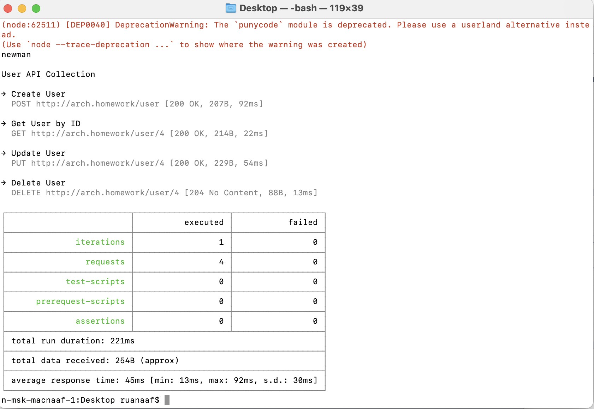

###Задание:
Создать RESTful CRUD
###Описание/Пошаговая инструкция выполнения домашнего задания:
1. Сделать простейший RESTful CRUD по созданию, удалению, просмотру и обновлению пользователей
Пример API - https://app.swaggerhub.com/apis/otus55/users/1.0.0
2. Добавить базу данных для приложения 
3. Конфигурация приложения должна хранится в Configmaps
4. Доступы к БД должны храниться в Secrets 
5. Первоначальные миграции должны быть оформлены в качестве Job-ы, если это требуется 
6. Ingress-ы должны также вести на url arch.homework/
7. На выходе предоставить 
- ссылка на директорию в github, где находится директория с манифестами кубернетеса 
- инструкция по запуску приложения
- команда установки БД из helm, вместе с файлом values.yaml
- команда применения первоначальных миграций
- команда kubectl apply -f, которая запускает в правильном порядке манифесты кубернетеса
- Postman коллекция, в которой будут представлены примеры запросов к сервису на создание, получение, изменение и удаление пользователя. Важно: в postman коллекции использовать базовый url - arch.homework
- проверить корректность работы приложения, используя созданную коллекцию newman run коллекция_постман и приложить 
  скриншот/вывод исполнения корректной работы

Обратите внимание, что при сборке на m1 при запуске вашего контейнера на стандартных платформах будет ошибка такого вида:
standard_init_linux.go:228: exec user process caused: exec format error
Для сборки рекомендую указать тип платформы linux/amd64:
docker build --platform linux/amd64 -t tag

Более подробно можно прочитать в статье: https://programmerah.com/how-to-solve-docker-run-error-standard_init_linux-go219-exec-user-process-caused-exec-format-error-39221/
***
####Used commands:
```
./gradlew clean build (в корне проекта)

docker build --platform linux/amd64 -t ll-o-m .

docker tag ll-o-m myteayourmilk/ll-o-m:latest

docker push myteayourmilk/ll-o-m:latest

```
/chart
```
helm repo add bitnami https://charts.bitnami.com/bitnami

helm install my-postgresql --values values.yml bitnami/postgresql
```

/kubernetes
```
kubectl apply -f ./
kubectl get all

```

kubectl port-forward --namespace default svc/my-postgresql 5432:5432 &
PGPASSWORD=mypassword psql --host 127.0.0.1 -U myuser -d usersdb -p 5432

когда хочешь начать с чистого листа:
```
helm uninstall my-postgresql   
kubectl delete all --all
kubectl delete pvc --all
kubectl delete secret --all
kubectl delete configmap --all
```

Newman

