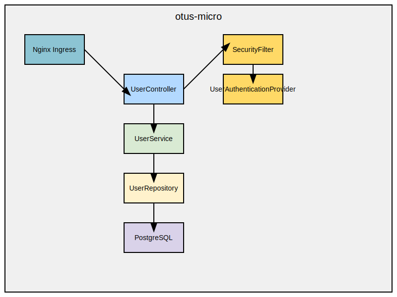

###Задание:
Backend for frontends. Apigateway
###Описание/Пошаговая инструкция выполнения домашнего задания:
1. Добавить в приложение аутентификацию и регистрацию пользователей. 
2. Реализовать сценарий "Изменение и просмотр данных в профиле клиента". 
3. Пользователь регистрируется. Заходит под собой и по определенному урлу получает данные о своем профиле. Может поменять данные в профиле. Данные профиля для чтения и редактирования не должны быть доступны другим клиентам (аутентифицированным или нет).

###На выходе должны быть
0. Описание архитектурного решения и схема взаимодействия сервисов (в виде картинки)
1. Команда установки приложения (из helm-а или из манифестов). Обязательно указать в каком namespace нужно 
   устанавливать. 
2. Тесты постмана, которые прогоняют сценарий:
- регистрация пользователя 1
- проверка, что изменение и получение профиля пользователя недоступно без логина
- вход пользователя 1
- изменение профиля пользователя 1
- проверка, что профиль поменялся
- регистрация пользователя 2
- вход пользователя 2
- проверка, что пользователь2 не имеет доступа на чтение и редактирование профиля пользователя 1.

###Used commands:
```
./gradlew clean build (в корне проекта)

docker build --platform linux/amd64 -t ll-o-m .

docker tag ll-o-m myteayourmilk/ll-o-m:test

docker push myteayourmilk/ll-o-m:test
```

/chart
```
helm repo update
```

/prometheus
```
helm install my-postgresql --values values.yml bitnami/postgresql
```

/kubernetes
```
kubectl apply -f ./
kubectl get all

```

Newman в /resources:
```
newman run postman_collection_auth.json
```

Scheme:


Newman results:


Micronaut security documentation:

https://micronaut-projects.github.io/micronaut-security/3.9.4/guide/index.html