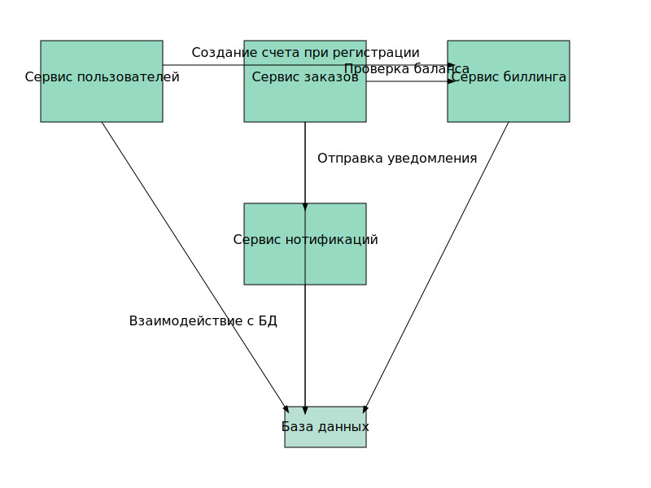

###Задание:
Реализовать сервис заказа. Сервис биллинга. Сервис нотификаций.
###Описание/Пошаговая инструкция выполнения домашнего задания:
1. При создании пользователя, необходимо создавать аккаунт в сервисе биллинга. В сервисе биллинга должна быть возможность положить деньги на аккаунт и снять деньги. 
2. Сервис нотификаций позволяет отправить сообщение на email. И позволяет получить список сообщений по методу API. 
3. Пользователь может создать заказ. У заказа есть параметр - цена заказа.
Заказ происходит в 2 этапа:
- сначала снимаем деньги с пользователя с помощью сервиса биллинга
- отсылаем пользователю сообщение на почту с результатами оформления заказа. Если биллинг подтвердил платеж, должно 
  отослаться письмо счастья. Если нет, то письмо горя.

4. Упрощаем и считаем, что ничего плохого с сервисами происходить не может (они не могут падать и т.д.). Сервис 
нотификаций на самом деле не отправляет, а просто сохраняет в БД.

###На выходе должны быть
1. описание архитектурного решения и схема взаимодействия сервисов (в виде картинки)
2. тесты постмана, которые прогоняют сценарий:
- Создать пользователя. Должен создаться аккаунт в биллинге.

- Положить деньги на счет пользователя через сервис биллинга.
  
- Сделать заказ, на который хватает денег.
  
- Посмотреть деньги на счету пользователя и убедиться, что их сняли.
  
- Посмотреть в сервисе нотификаций отправленные сообщения и убедиться, что сообщение отправилось
  
- Сделать заказ, на который не хватает денег.
  
- Посмотреть деньги на счету пользователя и убедиться, что их количество не поменялось.
  
- Посмотреть в сервисе нотификаций отправленные сообщения и убедиться, что сообщение отправилось.
###Used commands:
```
./gradlew clean build (в корне проекта)

docker build --platform linux/amd64 -t ll-o-m .

docker tag ll-o-m myteayourmilk/ll-o-m:test

docker push myteayourmilk/ll-o-m:test
```

/chart
```
helm repo update
```

/prometheus
```
helm install my-postgresql --values values.yml bitnami/postgresql
```

/kubernetes
```
kubectl apply -f ./
kubectl get all

```

/resources:
```
newman run postman_collection_auth.json
```

когда хочешь начать с чистого листа:
```
helm uninstall stack
helm uninstall my-postgresql
kubectl delete all --all
kubectl delete pvc --all
kubectl delete secret --all
kubectl delete configmap --all
```

Scheme:


Newman results:

