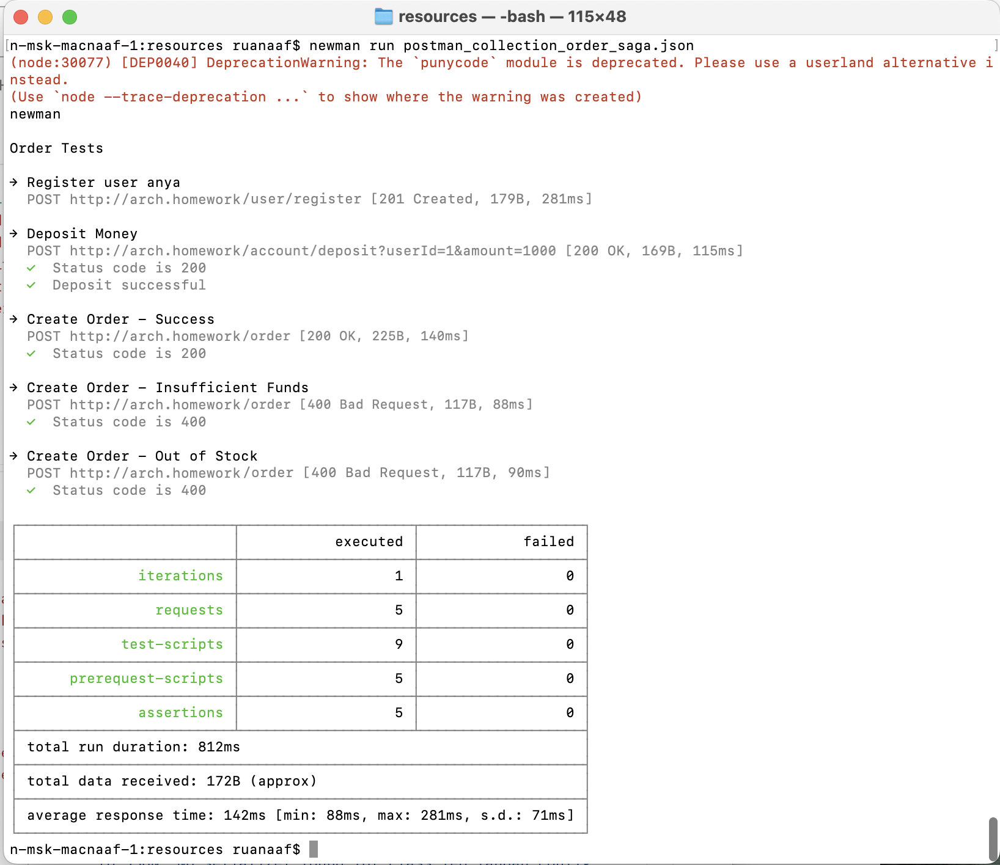

###Задание:
Распределенные транзакции
###Описание/Пошаговая инструкция выполнения домашнего задания:
Можно использовать приведенный ниже сценарий для интернет-магазина или придумать свой.

Дефолтный сценарий:

Реализовать сервисы "Платеж", "Склад", "Доставка".

Для сервиса "Заказ", в рамках метода "создание заказа" реализовать механизм распределенной транзакции (на основе Саги или двухфазного коммита).

Во время создания заказа необходимо:

- в сервисе "Платеж" убедиться, что платеж прошел
- в сервисе "Склад" зарезервировать конкретный товар на складе
- в сервисе "Доставка" зарезервировать курьера на конкретный слот времени.

Если хотя бы один из пунктов не получилось сделать, необходимо откатить все остальные изменения.

###На выходе должно быть:

0) описание того, какой паттерн для реализации распределенной транзакции использовался

1) команда установки приложения (из helm-а или из манифестов). Обязательно указать в каком namespace нужно устанавливать и команду создания namespace, если это важно для сервиса.

2) тесты в postman

###Used commands:
```
./gradlew clean build (в корне проекта)

docker build --platform linux/amd64 -t ll-o-m .

docker tag ll-o-m myteayourmilk/ll-o-m:test

docker push myteayourmilk/ll-o-m:test
```

/chart
```
helm repo update
helm repo add bitnami https://charts.bitnami.com/bitnami
helm install my-postgresql --values values.yml bitnami/postgresql
```

/kubernetes
```
kubectl apply -f ./
kubectl get all

```

/resources:
```
newman run postman_collection_order_saga.json
```

когда хочешь начать с чистого листа:
```
helm uninstall stack
helm uninstall my-postgresql
hwlm repo remove bitnami
kubectl delete all --all
kubectl delete pvc --all
kubectl delete secret --all
kubectl delete configmap --all
```

Newman results:
postman_collection_order_saga.json



