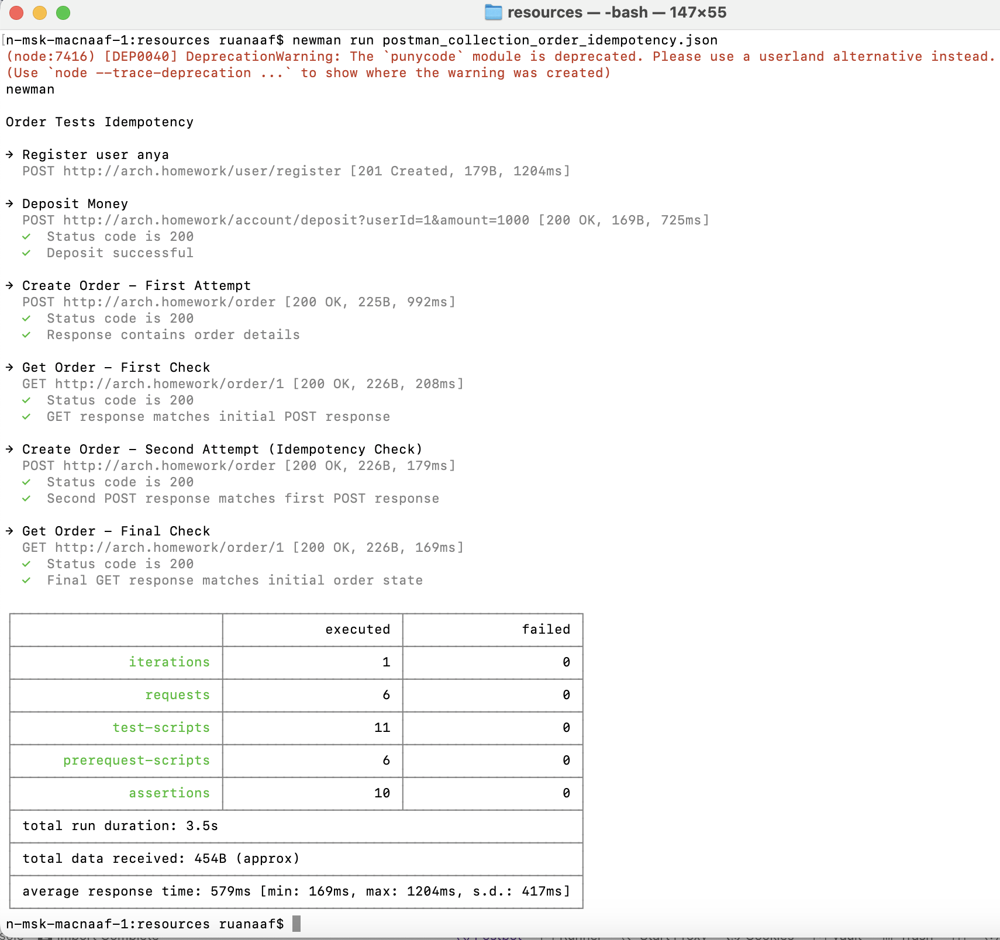

###Задание:
Идемпотентость и коммутативность API в HTTP и очередях
###Описание/Пошаговая инструкция выполнения домашнего задания:
В этом ДЗ вы создадите сервис "Заказ" (или научитесь использовать сервис из прошлого занятия) и для одного из его методов, например, "создание заказа" сделаете идемпотетным.

###На выходе должно быть:

0) описание того, какой паттерн для реализации идемпотентности использовался

1) команда установки приложения (из helm-а или из манифестов). Обязательно указать в каком namespace нужно устанавливать и команду создания namespace, если это важно для сервиса.

2) тесты в postman

###Пояснение:
В домашнем задании был использован паттерн "Conditional Update" (Условное обновление). Этот паттерн позволяет обеспечить идемпотентность 
операции создания заказа, проверяя существование заказа перед его созданием и возвращая существующий заказ, если он уже был создан.
Основное изменение логики содержится в коде:
```java
Optional<Order> existingOrder = orderRepository.findById(order.getId());
if (existingOrder.isPresent()) {
    return existingOrder.get();
}
```
Если заказ уже существует, возвращаем его, не выполняя никаких дополнительных действий.

Если заказа нет, продолжаем процесс создания нового заказа.

После успешного выполнения саги, сохраняем заказ в базу данных.

Возвращаем сохраненный заказ клиенту.

###Used commands:
/
```
./gradlew clean build

docker build --platform linux/amd64 -t ll-o-m .

docker tag ll-o-m myteayourmilk/ll-o-m:test

docker push myteayourmilk/ll-o-m:test
```

/chart
```
helm repo update
helm repo add bitnami https://charts.bitnami.com/bitnami
helm install my-postgresql --values values.yml bitnami/postgresql
```

/kubernetes
```
kubectl apply -f ./
kubectl get all

```

/resources:
```
newman run postman_collection_order_idempotency.json
```

когда хочешь начать с чистого листа:
```
helm uninstall stack
helm uninstall my-postgresql
hwlm repo remove bitnami
kubectl delete all --all
kubectl delete pvc --all
kubectl delete secret --all
kubectl delete configmap --all
```

Newman results:
postman_collection_order_idempotency.json



